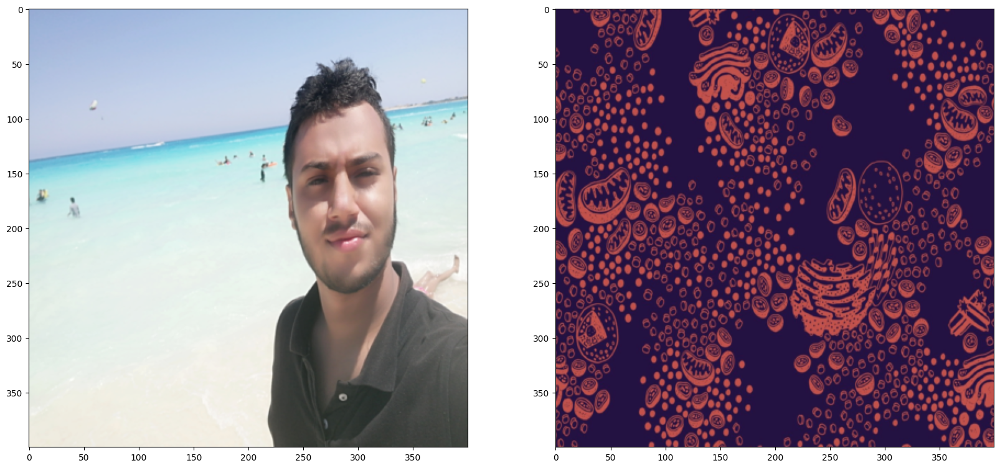
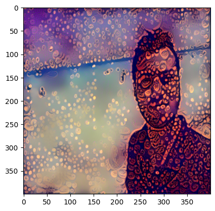

# Neural Style Transfer Implementation

This repository contains an implementation of the neural style transfer technique, as described in the original research paper. We utilized a pre-trained VGG19 model to achieve style transfer between a content image and a style image.

## Methodology

The implementation follows the detailed methodology outlined in the paper, including:

* implementing using Pytorch framework
* Loading pre-trained VGG19 weights.
* Calculating weighted content and style loss functions.
* Iteratively updating the target image to minimize the combined loss.

## Results

The following image illustrates the content and style images used in the experiment:

After training for 5000 epochs, the total loss decreased significantly from 2024718073856.0 to 271570763776.0. The resulting stylized image is shown below:

This demonstrates the successful application of neural style transfer using the VGG19 architecture.